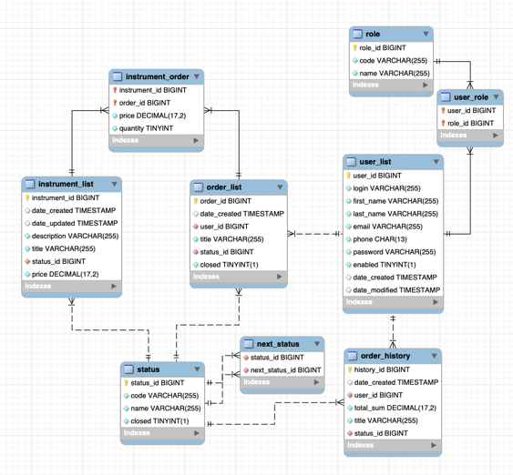

# Springboot Musical instruments store

This is a simple musical instruments store made with Springboot as a backend. It uses a MySQL database to store the data. 
Authentication is done with JWT. Communication with id done via JSON requests. 

You can use postman to test the API.

## How to run

1. Clone the project
2. Pull the MySQL image `docker pull mysql:latest`
3. Create network `docker network create musical-instruments-network`
4. Run MySQL container `docker run --name mysql-store --network musical-instruments-network -e MYSQL_ROOT_PASSWORD=***** -e MYSQL_DATABASE=Musical_instruments_store -e MYSQL_USER=***** -e MYSQL_PASSWORD=***** -d mysql:latest`
5. Build the project `mvn clean install`
6. Build the docker image `docker build -t spring-musical-store .`
7. Run the docker image `docker run --network musical-instruments-network --name musical-store -p 8080:8080 -d spring-musical-store`
8. You can access the MySQL database with your command line `docker exec -it *NETWORK ID* bash`
9. Then you can access the database with `mysql -u*user* -p*password*`
10. You can access the API with `http://localhost:8080`
11. You can add roles to in the database with `INSERT INTO Musical_instruments_store.role(code, name) VALUES ("ROLE_USER", "user");` and so on
12. You can add roles after you have registered a user with your MySQL command line
13. Enjoy!

You can also use the docker-compose file to run the project.

You can use `Requests.http` file to test the API.

## How to contribute

1. Fork the project
2. Create a new branch
3. Make your changes
4. Commit your changes
5. Push your branch
6. Create a pull request