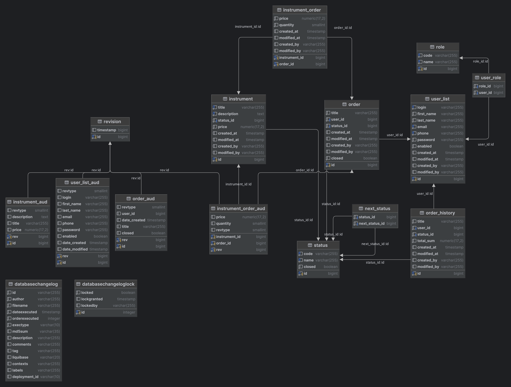

# Springboot Musical Instruments Store

This is a simple musical instruments store built with Spring Boot 3.1.5 as the backend, utilizing a PostgreSQL database
for data storage. Authentication is handled using JWT, and OAuth 2 can also be configured (don't forget to add keys
in `application.yaml`). Communication is performed via JSON requests.

You can use Postman to test the API, or visit `http://localhost:8080/swagger-ui` for API testing. The admin user
is `admin` and the password is `admin`.

## How to Run

1. Clone the project.
2. Configure OAuth 2 and JWT in `application.yaml`.
3. Use `docker-compose.yaml` to set up the PostgreSQL database, PgAdmin, and run the project.
4. Build the project with `mvn clean install`.
5. Access the API at `http://localhost:8080`.

You can also run the project with `mvn spring-boot:run`. It will use additional `composer.yaml` to set up the database and PgAdmin.

You can use the `Requests.http` file to test the API.

## Technologies Used

- Java 21
- Spring Boot 3.1.5
- PostgreSQL
- Hibernate
- Spring Core
- Spring Data JPA
- Spring Security
- Spring Web
- Spring Validation
- Spring DevTools
- PgAdmin
- Docker
- Docker Compose
- OAuth 2
- JWT
- Swagger
- Lombok
- MapStruct
- Maven

## How to Contribute

1. Fork the project.
2. Create a new branch.
3. Make your changes.
4. Commit your changes.
5. Push your branch.
6. Create a pull request.
